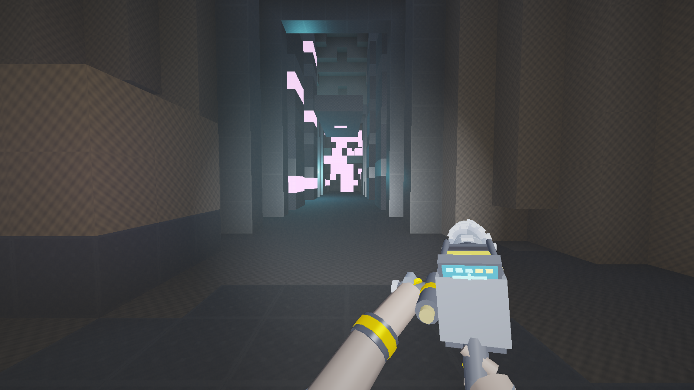

# Voidfall Dredge - 3D Character & Enemy Model Catalog

This directory maintains canonical, up-to-date visual reference captures of all hostile entities, delver contractor classes, and primary equipment models in **Voidfall Dredge**.

---

## Master Roster Showcase Montage


*Generated automatically via `python scripts/capture_models.py` (3x2 1200x450 studio contact sheet).*

---

## 1. Hostile Entities & Predators

### 1.1 Void Stalker (`enemy_void_stalker.png`)


- **Entity Type**: Predatory Subterranean Chitin Lurker
- **Threat Level**: Medium-High (High in unlit cavern corridors)
- **Visual Features**:
  - Segmented dark void basalt obsidian carapace (`RGB(0.04, 0.04, 0.05)`, PBR Roughness 0.25, Metallic 0.40).
  - High-intensity bioluminescent compound eyes emitting ruby laser tracers (`RGB(0.92, 0.12, 0.96)`, Emissive 6.0 with HDR bloom).
  - Coiled segmented scorpion tail with venomous stinger.
  - Articulated mantis scythe claws with serrated metallic fangs.
  - Dorsal void quill array capable of launching physical projectile spines.
- **Combat Behaviors**:
  - Shadows players from dark corners; enrages and charges upon hearing mining drill noise.
  - Flanks along walls and ceilings; leaps forward into aggressive melee lunges.
  - **Predictive Lead Aiming**: Shooter stalkers calculate player velocity vectors in real time and lead their targets with crystalline void spine volleys.
  - **Aggressive Counter-Lunges**: Approaching within 6.8m provokes immediate high-speed counter-charges rather than retreat.
  - Susceptible to Scout Sonar Pulses (inflicts 3.0s disorientation stun).

---

### 1.2 Seismic Burrower (`enemy_seismic_burrower.png`)


- **Entity Type**: Heavy Armored Subterranean Dreadnought
- **Threat Level**: Critical (Spawns in Hazard Phase 3 and Extraction Waves)
- **Visual Features**:
  - Massive rotating conical drill borer with radial hardened tungsten cutting teeth (`RGB(0.65, 0.60, 0.55)`, Metallic 0.85, Roughness 0.15).
  - Molten magma apex tip and lateral slag exhaust heat vents (`RGB(2.5, 0.45, 0.05)`, Emissive 6.0 with thermal pulse glow).
  - Articulated 4-segment serpentine armored basalt carapace with procedural crawling wiggles.
  - Heavy dorsal obsidian crest ridges providing top armor against falling rocks.
- **Combat Behaviors**:
  - Excavates and destroys soft voxels (`MAT_DIRT`, `MAT_CRYSTAL`, `MAT_LOOSE_ROCK`) in direct path toward target.
  - Breaching and kinetic ram attacks trigger structural tremors, screen trauma, and roof collapses.
  - Takes 2.5x damage from Demolitionist explosive charges and concussion blasts.

---

## 2. Delver Contractor Classes (Player Archetypes)

### 2.1 Kaelen — Demolitionist (`character_demolitionist_kaelen.png`)


- **Contractor Name**: Kaelen
- **Archetype / Role**: Demolitionist // Heavy Breacher
- **Visual Theme & Equipment**:
  - Heavy blast-resistant pressurized EVA pressure suit with reinforced dark charcoal weave (`RGB(0.18, 0.20, 0.24)`).
  - Hazard industrial amber/gold primary accents (`RGB(0.95, 0.55, 0.05)`).
  - Glowing curved amber blast-protective visor (`RGB(1.0, 0.65, 0.10)`, Emissive 5.0).
  - Angled blast deflector shoulder pauldrons and chest life-support telemetry module.
  - Right hand wields heavy industrial breacher drill; tactical concussion charge rail mounted on suit harness.
- **Baseline Attributes**:
  - Health: 100 HP | Mining Speed: 1.40x | Move Speed: 1.00x
  - Trait: Surgical Blast & Volatile Refining (+25% yield from volatile ore nodes, precision blast sculpting).

---

### 2.2 Rhodes — Vanguard (`character_vanguard_rhodes.png`)


- **Contractor Name**: Rhodes
- **Archetype / Role**: Vanguard // Armored Stabilizer
- **Visual Theme & Equipment**:
  - Heavy armored exosuit with double-plated tectonic bulkhead armor plates.
  - Industrial cyan primary accents (`RGB(0.20, 0.85, 1.00)`).
  - High-defense ballistic reinforced helmet with narrow optical slit visor (`RGB(0.20, 0.90, 1.00)`, Emissive 5.0).
  - Oversized fortress shoulder pauldrons and knee impact absorb plates.
  - Right hand wields heavy stabilized mining drill; bulkheads deployable to deflect cave-in debris.
- **Baseline Attributes**:
  - Health: 135 HP | Mining Speed: 1.00x | Move Speed: 0.88x | Max Bulkheads: 12
  - Trait: Tectonic Bulkhead Plating (50% passive damage reduction against falling debris, placed bulkheads deflect rocks).

---

### 2.3 Vesper — Scout (`character_scout_vesper.png`)


- **Contractor Name**: Vesper
- **Archetype / Role**: Scout // Acoustic Pathfinder
- **Visual Theme & Equipment**:
  - Streamlined lightweight mobility suit crafted from high-tensile carbon composite.
  - Bio-luminescent emerald survey accents (`RGB(0.15, 1.00, 0.45)`).
  - Panoramic curved reconnaissance visor providing wide peripheral scanning optics (`RGB(0.15, 1.00, 0.45)`, Emissive 5.0).
  - Aerodynamic shoulder pauldrons, dual high-thrust vector nozzles on Exo-Pack.
  - Wrist-mounted acoustic sonar transceiver dish and high-tension pneumatic grapple winch spool.
- **Baseline Attributes**:
  - Health: 80 HP | Mining Speed: 1.00x | Move Speed: 1.20x | Sonar Radius: 22m
  - Trait: Acoustic Resonance & High-Tension Winch (22m sonar scan sphere, active sonar pulses stun Stalkers, 1.5x grapple reel speed).

---

## 3. Primary Rig & Viewmodel

### 3.1 Modular Mining Drill Rig (`system_viewmodel_drill.png`)


- **Equipment Type**: Handheld Industrial Hydraulic Excavator & Rotary Drill
- **Visual Features**:
  - Fluted high-carbon titanium borer bit spinning at up to 1,800 RPM.
  - Dual reciprocating pneumatic pistons driving forward impact kinetic strokes.
  - Heavy cast alloy chassis with class-themed accent fairings and heat sinks.
  - Integrated digital telemetry display showing block hardness, RPM, and contact temperature.
  - Dynamic spark emitter casting real-time contact particle debris upon block collision.

---

## Automated Model Asset Maintenance

To regenerate all model reference images and the master showcase montage at any time:

```bash
python scripts/capture_models.py
```

Or invoke the engine directly:
```bash
./build/Release/VoidfallDredge.exe --capture-models
```

This ensures that any subsequent modifications to shaders, PBR parameters, lighting, or mesh geometry are immediately and accurately captured into the codebase repository.
