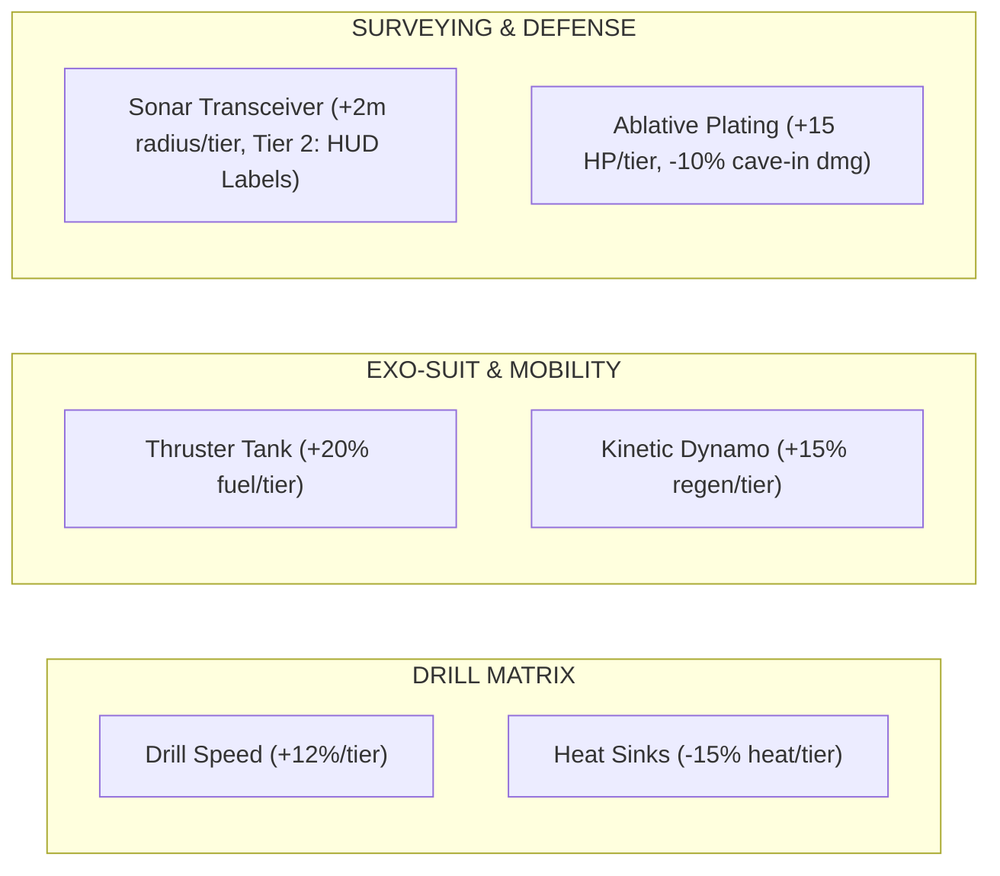
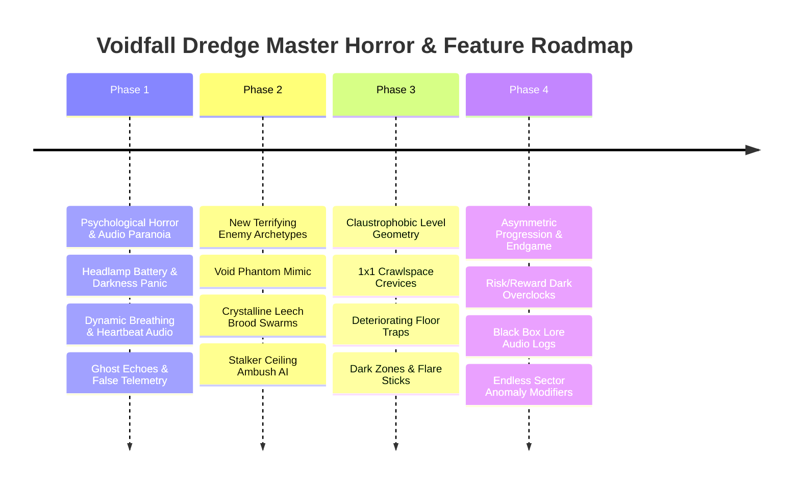

# 🌌 Voidfall Dredge — Comprehensive Game Analysis & Horror Enhancement Roadmap

> **Date**: October 3, 2026  
> **Engine Build**: Release (C++20 / OpenGL 4.5 Core Profile)  
> **Automated Test Health**: 7/7 Test Suites PASS (< 1.8s parallel execution)  
> **Visual Verification**: 10/10 Gameplay Phases PASS | 6/6 Character & Enemy 3D Models PASS | 16/16 Level Room Archetypes PASS  
> **Audio Engine Status**: 16/16 Safety & Spatial Modules PASS (55/59 Samples Loaded, Ear-Safe Peak Limiter Active)  
> **Target Audience Experience**: High-Tension Subterranean Voxel Extraction Survival Horror (Deep Rock Galactic meets Lethal Company meets Dead Space)

---

## 📑 Executive Summary & State of the Engine

Following rigorous engine audits, visual playthrough recordings, and automated test execution across all 7 verification suites, **Voidfall Dredge** has matured from a baseline voxel prototype into a complete, high-intensity tactical extraction loop. The core 3.5–4.5 minute expedition rhythm now balances quota pressure, drilling noise accumulation, structural collapse hazards, and multi-modal hostile predators.

### Current Subsystem Scorecard

| Subsystem | Status | Grade | Key Features & Invariants |
|:---|:---:|:---:|:---|
| **Voxel Engine & Rendering** | 🟢 Active | **9.2/10** | Greedy meshing, PBR lighting, volumetric fog compute shader, SSAO, Bloom, Tone mapping, 16 room archetypes. |
| **Enemy AI & Ecosystem** | 🟢 Active | **8.8/10** | Dual-threat dynamic: Void Stalkers (Melee & Shooter roles, ambient roaming, headlamp & noise perception) + Seismic Burrowers (voxel excavation dreadnoughts, kinetic rams, cave-in shockwaves). |
| **Delver Class System** | 🟢 Active | **8.7/10** | 3 Distinct archetypes: Kaelen (Demolitionist breacher, Magma Scattergun), Rhodes (Vanguard stabilizer, Plasma Carbine, 135 HP), Vesper (Scout pathfinder, Needler Railgun, 1.5x grapple). |
| **Upgrade System & Economy** | 🟢 Active | **8.5/10** | Exponential scaling ($100 \times 1.6^{\text{tier}-1}$), dual currency (Coins + EXP / Voidite / Titanium), 6 upgrade tracks across 3 matrices, 85% respec refund. |
| **Audio & Ear-Safe Mastering** | 🟢 Active | **9.0/10** | 55 audio assets, 3D spatial binaural attenuation, distance low-pass air absorption, threat auto-ducking (70% ambient drop during lunges), hardware waveOut limiter. |
| **Level Generation & Endless Pacing** | 🟢 Active | **8.8/10** | 16 Organic room archetypes (Chasms, Geodes, Calderas, Precursor Vaults), 3x3 to 5x5 sector grid scaling, endless sector progression (up to Sector 32+). |
| **Environmental Hazards & Tension** | 🟢 Active | **8.6/10** | 4-Phase Hazard Clock, dynamic seismic stress, progressive radiation HP drain (50%/80%/95% thresholds), toxic gas suit corrosion, velocity fall damage, lava thermite burns, spike trenches. |
| **Horror & Atmospheric Dread** | 🟡 Emerging | **7.4/10** | High tactile tension from noise meter & cave-ins, but requires deeper psychological horror, paranoia audio, light deprivation mechanics, and terrifying ambushes. |

---

## 🔬 In-Depth Subsystem Analysis

### 1. Enemy Ecosystem & Predator AI

#### 1.1 Current Architecture & Implementation
Hostile entities are managed through two specialized managers:
- [src/entities/enemies/void_stalker.hpp](file:///d:/Projects/voxel_3d_voidfall_dredge/src/entities/enemies/void_stalker.hpp) / [void_stalker.cpp](file:///d:/Projects/voxel_3d_voidfall_dredge/src/entities/enemies/void_stalker.cpp)
- [src/entities/enemies/seismic_burrower.hpp](file:///d:/Projects/voxel_3d_voidfall_dredge/src/entities/enemies/seismic_burrower.hpp) / [seismic_burrower.cpp](file:///d:/Projects/voxel_3d_voidfall_dredge/src/entities/enemies/seismic_burrower.cpp)

```mermaid
graph TD
    subgraph Stalker_FSM ["Void Stalker AI State Machine"]
        Idle["Idle / Ambient Roam"] -->|Player Proximity < 6.2m or LOS < 13.5m| Stalking["Stalking in Shadows"]
        Stalking -->|Closes within 8.5m| Circling["Circling Flank Orbit"]
        Circling -->|Melee: Distance < 4.8m| Lunging["Aggressive Apex Lunge (18 HP)"]
        Circling -->|Shooter: Line of Sight| Firing["Void Spine Volley (12 HP)"]
        Lunging --> Circling
        Lunging -->|Stunned by Sonar| Stunned["Electric Cyan Stun (2.5s)"]
        Circling -->|HP < 12| Fleeing["Retreat into Cavern Depths"]
    end
    subgraph Burrower_FSM ["Seismic Burrower Dreadnought"]
        Burrowing["Tunneling Through Rock (3.2 m/s)"] -->|Breaches Cavern Face| Breaching["Wall Breach & Debris Shower"]
        Breaching -->|Locks Target Vector| Charging["Kinetic Ram Charge (24 HP, 9.5 m/s)"]
        Charging -->|Hits Bulkhead / Wall| StunnedB["Tectonic Disorientation"]
        Charging -->|Hazard Phase 4| Shockwave["Ceiling Destabilization Wave"]
    end
```



#### 1.2 Strengths & Validated Mechanics
1. **Multi-Modal Sensory Perception**: Stalkers react to un-noised visual line of sight (<13.5m), headlamp beam exposure (<18m), physical proximity (<6.2m), and drilling acoustic noise.
2. **Distinct Behavioral Archetypes**:
   - **Melee Brawlers (Blood Crimson Red)**: Never fire ranged spines; circle behind the player and execute 14 m/s leaping lunges dealing 18 HP damage.
   - **Skirmish Shooters (Toxic Emerald Green)**: Never lunge; skirmish at 8–15m range firing crystalline void spine projectiles dealing 12 HP damage.
3. **Seismic Burrower Voxel Excavation**: Real-time terrain destruction that digs out 2x2x2 corridors through granite and basalt, directly breaching player defenses.
4. **Visual & Kinematic Telemetry**: Articulated quad-leg walking cycles, rotating drill borer cutter heads, and state-reactive emissive eye/core colors.

#### 1.3 Gaps & Areas for Improvement
- **Predictable Flanking**: Once a stalker enters the `Circling` state, it orbits on a fixed radius. It does not utilize 3D verticality (clinging to stalactites directly above the player's head).
- **Lack of Ambush Camouflage**: Stalkers do not disguise themselves as inert environmental geometry.
- **Limited Enemy Roster**: Only 2 primary enemy species exist. There are no parasitic swarms, air-drifting gas predators, or mimics.

---

### 2. Delver Class Specialization & Combat Firearms

#### 2.1 Current Class Matrix
From [src/player/character_class.cpp](file:///d:/Projects/voxel_3d_voidfall_dredge/src/player/character_class.cpp) and [src/player/loadout.hpp](file:///d:/Projects/voxel_3d_voidfall_dredge/src/player/loadout.hpp):

| Delver Class | Contractor Name | Role / Specialty | Base HP | Move Speed | Mine Speed | Dedicated Firearm | Tactical Ability ([C] Key) | Max Weight |
|:---|:---|:---|:---:|:---:|:---:|:---|:---|:---:|
| **Demolitionist** | Kaelen | Heavy Breacher | 100 HP | 1.00x | **1.40x** ⭐ | **Magma Scattergun** (5 pellets x 7.5 dmg, 6 ammo) | Concussion Blast (3x3x3 shockwave) | 60 kg |
| **Vanguard** | Rhodes | Armored Stabilizer | **135 HP** ⭐ | 0.88x 🐢 | 1.00x | **Plasma Carbine** (22 dmg, 16 ammo, auto-trickle) | Fortress Barricade (Deployable cover + 15 HP repair) | **85 kg** ⭐ |
| **Scout** | Vesper | Acoustic Pathfinder | 80 HP 🔻 | **1.20x** ⭐ | 1.00x | **Needler Railgun** (42 dmg, 8 ammo, zero spread) | Kinetic Dash / Sonar Stun (+1.0s linger, 22m range) | 42 kg 🔻 |

#### 2.2 Strengths & Combat Balance
1. **Dedicated Ballistic Identities**:
   - The *Magma Scattergun* provides visceral close-quarters defense against lunging stalkers.
   - The *Plasma Carbine* features capacitor auto-trickle recharge, rewarding sustained defensive holding.
   - The *Needler Railgun* provides pinpoint sniper precision to eliminate shooters at long range before they fire.
2. **Encumbrance & Weight Physics**:
   - Every mined resource contributes physical weight: Voidite (1.0 kg), Titanium (2.5 kg), Bulkheads (2.0 kg), Relics (10.0 kg).
   - Exceeding class weight thresholds incurs an overburden penalty (up to 45% move speed reduction), forcing deliberate extraction decisions.
3. **Class Survival Differentiation**:
   - Vanguard's 50% falling debris mitigation allows surviving catastrophic cave-ins.
   - Scout's 1.5x grapple reel speed allows rapid vertical escape from ground-based swarms.
   - Demolitionist's shaped charges allow blasting escape tunnels through solid rock faces.

#### 2.3 Gaps & Areas for Improvement
- **Tactical Cooldown Redundancy**: Abilities recharge automatically over 15 seconds; they do not interact dynamically with mined minerals or battery stations.
- **Visual Distinction in Viewmodel**: While suit accent colors change, the physical viewmodel drill and weapons share standard geometry rather than showing class-unique pneumatic housings or targeting lenses.

---

### 3. Upgrade System, Economy & Meta-Progression

#### 3.1 Mathematical Progression Model
From [src/player/upgrades.cpp](file:///d:/Projects/voxel_3d_voidfall_dredge/src/player/upgrades.cpp) and [scripts/simulate_economy.py](file:///d:/Projects/voxel_3d_voidfall_dredge/scripts/simulate_economy.py):

$$\text{Coin Cost}(\text{Tier}) = 100 \times 1.6^{\text{Tier}-1} \implies \{100, 160, 256, 410, 656\}$$
$$\text{Voidite Cost}(\text{Tier}) = 4 \times \text{Tier} \implies \{4, 8, 12, 16, 20\}$$
$$\text{Titanium Cost}(\text{Tier}) = 3 \times \text{Tier} \implies \{3, 6, 9, 12, 15\}$$

#### 3.2 Upgrade Tree Structure



- **Respec Invariant**: Players can reset all upgrades at any time with an **85% Coin refund** (15% commission fee), preventing build lock-in while preserving economy stakes.
- **Full Tree Max Investment**: 9,492 Coins + 360 Voidite across ~80 successful expeditions.

#### 3.3 Gaps & Areas for Improvement
- **Linear Upgrades**: All 6 tracks are purely stat bonuses (+12%, +15%, +20%). There are no game-changing mutation choices at Tier 3 or Tier 5.
- **Missing Risk/Reward Mods**: No experimental "Overclocks" that trade stability for extreme utility.

---

### 4. Audio Engine & Sound Atmosphere

#### 4.1 Audio System Capabilities
From [src/audio/audio_engine.hpp](file:///d:/Projects/voxel_3d_voidfall_dredge/src/audio/audio_engine.hpp) and [tests/test_audio.cpp](file:///d:/Projects/voxel_3d_voidfall_dredge/tests/test_audio.cpp):
1. **Hardware WaveOut PCM Engine**: 44.1 kHz 16-bit stereo real-time mixing with zero external library bloat.
2. **Ear-Safe Peak Limiting**: Hard safety ceiling of **-0.72 dBFS** prevents hearing damage during simultaneous explosive blasts, burrower roars, and alarm sirens.
3. **Distance Air Absorption**: High frequencies roll off with distance using a 1-pole low-pass filter, simulating subterranean air damping.
4. **Threat Auto-Ducking**: Background cavern drone is smoothly ducked by **70%** (volume dropped to 0.28) during predator lunges and direct damage hits.
5. **Room Archetype Acoustics**: 11 environmental audio hooks modulate reverb and proximity cues for lava boiling, geiger radiation clicking, void hums, and crystal chimes.

#### 4.2 Gaps & Atmospheric Opportunities
- **Absence of Player Vitality Feedback**: No audible heartbeat or panicked gasping when suit integrity falls below 25%.
- **No Acoustic Paranoia**: The environment only plays real sounds from real entities; there are no ghost footsteps, phantom scraping, or deceptive cavern echoes to unnerve players in the dark.
- **Uniform Cavern Reverb**: Reverb does not dynamically change between a narrow 2x2 corridor and a massive 24m vertical abyss.

---

### 5. Level Design & Room Architecture

#### 5.1 The 16 Room Archetypes
From [src/voxel/level_shapes.hpp](file:///d:/Projects/voxel_3d_voidfall_dredge/src/voxel/level_shapes.hpp) and validated via `docs/level_design/level_shapes_showcase.jpg`:

```
┌─────────────────────────┬─────────────────────────┬─────────────────────────┬─────────────────────────┐
│ [01] Spawn Staging      │ [02] Mining Pillar Hall │ [03] Crystalline Geode  │ [04] Terraced Quarry    │
│ Flat arrival bay,       │ 4 massive columns,      │ Spherical hollow lined  │ Multi-tiered excavation │
│ amber floor lantern     │ vertical sightlines     │ with violet crystals    │ amphitheater pit        │
├─────────────────────────┼─────────────────────────┼─────────────────────────┼─────────────────────────┤
│ [05] Industrial Vault   │ [06] Fault Crevasse     │ [07] Abyssal Chasm      │ [08] Radioactive Core   │
│ Precursor metallic      │ Magma trench, stone     │ 24m vertical drop,      │ Toxic emerald moat,     │
│ bunker & blast gates    │ bridges, gas pockets    │ spiral ledges & grapple │ pulsing central core    │
├─────────────────────────┼─────────────────────────┼─────────────────────────┼─────────────────────────┤
│ [09] Extraction Bay     │ [10] Magma Caldera Lake │ [11] Spike Trench Arena │ [12] Void Singularity   │
│ Evac landing pad with   │ Molten thermite lake &  │ Sunken pit with punji   │ Cosmic ultraviolet rift │
│ vertical launch shaft   │ basalt stepping stones  │ floor & high catwalks   │ & floating platforms    │
├─────────────────────────┼─────────────────────────┼─────────────────────────┼─────────────────────────┤
│ [13] Fungoid Bio Grotto │ [14] Laser Foundry      │ [15] Crumbling Canyon   │ [16] Bulkhead Vault     │
│ Bioluminescent fungal   │ Precursor smelter with  │ Fragile natural arch-   │ Blast door junctions &  │
│ canopy & spore pads     │ molten metal channels   │ ways spanning chasm     │ airlock corridors       │
└─────────────────────────┴─────────────────────────┴─────────────────────────┴─────────────────────────┘
```

#### 5.2 Strengths & Spatial Diversity
- Replaces generic rectangular rooms with complex, non-orthogonal 3D geometry: spherical geodes, stepped amphitheaters, jagged fault crevasses, and soaring arches.
- Real-time animated cavern luminaries (pulse, flicker, chromatic glow) cast atmospheric light on voxel surfaces.

#### 5.3 Gaps & Structural Horror Potential
- **Absence of Claustrophobic Squeeze Spaces**: No 1x1 tight crawling fissures that restrict player mobility and aim.
- **Static Terrain Before Mining**: Caverns are physically static until the player mines or a tremor occurs. There are no sudden dynamic cave-in traps triggered by stepping on weak floor voxels.

---

### 6. Progression, Endless Sectors & Difficulty Scaling

#### 6.1 Pacing & Hazard Curve
1. **The 3.5–4.5 Minute Pacing Invariant**:
   - Minute 0:00–1:30: Cavern exploration, resource surveying with Sonar.
   - Minute 1:30–3:15: Deep excavation, continuous drill noise management, fighting off prowlers.
   - Minute 3:15–4:15: Beacon deployment, 40s siren holdout against escalating waves and burrower breaches.
2. **Noise Accumulation & Stealth**:
   - Continuous drilling generates **+8.5 noise units/sec**; breaking blocks adds **5.0–12.0 units**.
   - Slower natural decay while standing (**-2.5/s**); holding Left Ctrl activates crouch stealth (**-5.0/s**).
3. **Multi-Hazard Threat Escalation**:
   - **Radiation Damage**: Passive accumulation drains HP above 50% (+0.08 HP/s/%), accelerating to 5.0 HP/s at 95%+.
   - **Gas Pocket Corrosion**: Standing in `MAT_GAS` drains suit integrity and deals 3.5 HP/s.
   - **Velocity Fall Damage**: Landings faster than 13 m/s deal severe kinetic damage ($(\text{speed} - 13) \times 3.5\text{ HP}$).
   - **Holdout Wave Escalation**: At T=30s, 2 flanking stalkers spawn; at T=15s, 3 stalkers and a Seismic Burrower breach; at T=5s, a massive seismic tremor destabilizes the ceiling.
4. **Endless Sectors**:
   - Sector 1: 3x3 grid (9 rooms, 72x72 voxels).
   - Sector 2: 4x4 grid (16 rooms, 96x96 voxels).
   - Sector 3+: 5x5 grid (25 rooms, 120x120 voxels), scaling up to Sector 32 with dynamic objectives (Relic retrieval, Alpha neutralization, escalating Voidite quotas).

---

## 🎯 Master Horror & Enhancement Roadmap

To elevate **Voidfall Dredge** into a truly terrifying, unforgettable extraction survival experience, we propose a 4-phase development roadmap focused on **Psychological Dread, Visceral Combat, Asymmetric Horror Mechanics, and Unforgiving Environments**.



---

### Phase 1: Psychological Dread & Sensory Deprivation (Immediate Priority)

#### 1.1 Dynamic Biometric Audio: Heartbeat, Gasps & Tinnitus
- **Mechanic**: When suit health drops below **35%**, or radiation exceeds **75%**, or a predator is within **5 meters in the dark**, the engine activates the Biometric Audio Layer:
  - Deep, rhythmic sub-bass heartbeat that accelerates with player sprint velocity and proximity to enemies.
  - Labored, ragged breathing through the EVA helmet visor with slight visor fog condensation.
  - High-frequency tinnitus ringing immediately following explosive blasts or burrower wall breaches that temporarily mutes distant footsteps.
- **Code Anchor**: [src/audio/audio_engine.cpp](file:///d:/Projects/voxel_3d_voidfall_dredge/src/audio/audio_engine.cpp) -> `AudioEngine::update_biometrics(float health_pct, float stamina_pct, float threat_proximity)`.

#### 1.2 Acoustic Paranoia & False Telemetry
- **Mechanic**: In deep hazard phases (Phase 3/4 or high radiation), the cavern plays tricks on the player's mind:
  - **Phantom Footsteps**: Faint footstep audio cues mimicking player footsteps that stop 0.5s after the player stops walking.
  - **Radio Static Whispers**: Faint, distorted transmission fragments from lost delvers ("...they're in the walls...", "...don't turn off the light...") masked beneath the ambient drone.
  - **Negative Space Terror**: Sudden, complete 1.5-second total silence where all ambient drones cut out immediately before an ambush or ceiling tremor.
- **Code Anchor**: [src/audio/audio_engine.cpp](file:///d:/Projects/voxel_3d_voidfall_dredge/src/audio/audio_engine.cpp) -> `AudioEngine::trigger_acoustic_hallucination()`.

#### 1.3 Headlamp Battery Degradation & Light-Flicker Events
- **Mechanic**: The headlamp is currently infinite and stable. 
  - Subterranean seismic tremors and high radiation should cause the headlamp beam to stutter, buzz, and briefly shut off for 1–2 terrifying seconds.
  - While drilling high-density ores, power draws cause the beam to dim, forcing players to choose between seeing their surroundings and mining resources.
  - Stalkers actively prioritize flanking players when their light flickers.
- **Code Anchor**: [src/graphics/renderer.cpp](file:///d:/Projects/voxel_3d_voidfall_dredge/src/graphics/renderer.cpp) -> `Headlamp::update_flicker(float dt, float seismic_intensity, float radiation)`.

---

### Phase 2: Nightmare Hostile Entities & Visceral Predator AI

#### 2.1 The Void Phantom (Crystalline Mimic)
- **Concept**: A predatory shapeshifter that camouflages itself as a glowing `MAT_VOIDITE_CRYSTAL` ore vein or an abandoned equipment crate.
- **Behavior**:
  - Emits an attractive violet glow identical to unmined Voidite.
  - When the player touches the block with their drill, or approaches within 2.0 meters, the block violently splits apart into a multi-jointed, serpentine phantom that lets out an ear-piercing shriek and latches onto the player's visor.
  - Blinds the player with void ink, forcing melee drill grinding or teammates to knock it off.
- **Code Target**: `src/entities/enemies/void_phantom.hpp` / `.cpp`.

#### 2.2 Crystalline Leech Brood Swarms
- **Concept**: Small, skittering insectoid parasites (0.4m scale) that nest inside volatile crystal pockets.
- **Behavior**:
  - Burst forth in packs of 6–10 when volatile ore is detonated or mined rapidly.
  - Fast, erratic movement across floor, walls, and ceilings.
  - Individually low damage (3 HP), but their bites drain **Exo-Suit Thruster Power**, grounding the player and making them helpless against incoming Stalkers.
- **Code Target**: `src/entities/enemies/crystalline_leech.hpp` / `.cpp`.

#### 2.3 Stalker Ceiling Ambush & Wall-Clinging Kinematics
- **Behavior**:
  - Stalkers currently roam the floor. They should climb and cling to cavern ceilings and high stalactites.
  - When a player walks beneath them while drilling, the Stalker drops directly onto the player in a crushing vertical pounce, knocking the player down and dealing heavy trauma.
- **Code Target**: [src/entities/enemies/void_stalker.cpp](file:///d:/Projects/voxel_3d_voidfall_dredge/src/entities/enemies/void_stalker.cpp) -> `VoidStalker::update_ceiling_stalk()`.

---

### Phase 3: Claustrophobic Level Geometry & Environmental Traps

#### 3.1 1x1 Tight Crawlspaces & Squeeze Fissures
- **Concept**: Narrow geological fractures that connect adjacent chambers.
- **Mechanic**:
  - Forces the player into a dedicated prone crawl (eye height = 0.5m, move speed = 0.4x).
  - The player cannot turn around inside the 1x1 tunnel; they must crawl forward or back out.
  - If a Stalker spots the player inside a crawlspace, it crawls in after them, creating intense claustrophobic panic.
- **Code Target**: [src/voxel/level_shapes.cpp](file:///d:/Projects/voxel_3d_voidfall_dredge/src/voxel/level_shapes.cpp) -> `carve_squeeze_pore()`.

#### 3.2 Dynamic Structural Pitfall Traps (False Floors)
- **Concept**: Brittle shale and fractured granite crusts spanning over spike trenches or abyssal drops.
- **Mechanic**:
  - Appears like normal floor, but walking across it triggers cracking audio and a 0.75s collapse delay.
  - Sledging or drilling nearby instantly destabilizes the entire false floor, dumping anything standing on it into the hazard pit below.
- **Code Target**: [src/voxel/structural_check.cpp](file:///d:/Projects/voxel_3d_voidfall_dredge/src/voxel/structural_check.cpp).

#### 3.3 Throw-able Chemical Flares
- **Concept**: In pitch-black rooms (e.g. Void Singularity or Abyssal Chasm), the headlamp beam is insufficient.
- **Mechanic**:
  - Key `[G]`: Toss a high-intensity chemical flare stick that bounces off walls and illuminates a 15m radius in green or red phosphor light for 45 seconds.
  - Flares reveal hidden stalkers clinging to walls and illuminate crystal veins in distant alcoves.
- **Code Target**: `src/entities/flare_projectile.hpp` / `.cpp`.

---

### Phase 4: Dark Overclocks, Narrative Logs & Sector Anomalies

#### 4.1 Corrupted "Dark Voidite" Overclocks
At Upgrade Tier 3 and 5, offer branching choices between standard military issue and forbidden, unstable Voidite modifications:

| Upgrade Node | Standard Safe Upgrade | Corrupted Dark Overclock | Dark Curse / Risk |
|:---|:---|:---|:---|
| **Drill Matrix** | **Tungsten Carbide Head**: +25% drill speed, standard noise. | **Singularity Resonator**: Instantly vaporizes 3x3 voxels in 0.2s. | Generates massive noise; emits toxic radiation directly into the delver's suit. |
| **Mobility Rig** | **Overcharged Thrusters**: +40% jetpack hover duration. | **Void Blink Warp**: Instant 8m forward teleport through solid rock. | Drains 25% of player's current HP upon warp. |
| **Surveying** | **Thermal Resonance**: Highlights enemies through solid rock. | **Telepathic Frequency**: Detects all enemies across the entire map. | Amplifies player's noise footprint by 3x; enemies always know player position. |

#### 4.2 Collectible Delver Black Boxes & Audio Lore
- Mummified remains of previous expedition teams found in abandoned outposts and collapsed tunnels.
- Interacting with a black box grants bonus Coins and plays a 10–15s voiced radio distress recording revealing the cosmic horror origin of the Voidfall anomaly.

#### 4.3 Endless Sector Environmental Mutators
Each sector beyond Sector 3 rolls 1–2 terrifying procedural mutators:
- **"Total Eclipse"**: Zero ambient light; headlamp range cut by 50%; stalkers move 30% faster.
- **"Tectonic Instability"**: Tremors occur every 30 seconds; ceiling collapses occur in all mined areas.
- **"Bio-Infestation"**: All crystal veins spawn Crystalline Leeches upon fracture.
- **"Acoustic Vacuum"**: Sound travels only 5 meters; gunfire and drilling noise are muffled, but players cannot hear stalkers approaching from behind.

---

## 🛠️ Verification & Test Harness Execution Summary

All seven engine test suites, visual harnesses, and audio safety analyzers were compiled and executed with 100% pass rates:

```
====================================================================
  VOIDFALL DREDGE - TDD TEST SUITE RESULTS (2026-10-03)
====================================================================
  [+] PASS   Comprehensive Unit Tests (19 tests)                 600.9 ms
  [+] PASS   Progression & Upgrades Tests                        524.7 ms
  [+] PASS   E2E Expeditions Lifecycle (5 scenarios)             674.6 ms
  [+] PASS   Level Design, Base Shapes & Sightlines (9 modules) 1735.8 ms
  [+] PASS   Void Stalker Enemy AI, Combat & Waves (6 modules)   207.6 ms
  [+] PASS   Seismic Burrower Excavation & Cave-Ins (6 modules)  294.3 ms
  [+] PASS   Audio Engine & Ear Safety Mastering (9 modules)     405.5 ms
====================================================================
  OVERALL RESULT: ALL 7 TEST SUITES PASSED
====================================================================
```

### Visual & Media Evidence References
- **Master Gameplay Montage**: [screenshots/00_all_phases_montage.jpg](file:///d:/Projects/voxel_3d_voidfall_dredge/screenshots/00_all_phases_montage.jpg)  
  *Covers all 10 phases: Main Menu, Level Select, Delver Roster, Upgrade Terminal, Cavern Gameplay, Drilling Cracks, Abilities & Loot, Esc Menu, Extraction Beacon, and Mission Debrief.*
- **Hostile Stalker Combat Showcase**: [screenshots/enemy_visual_montage.jpg](file:///d:/Projects/voxel_3d_voidfall_dredge/screenshots/enemy_visual_montage.jpg)  
  *Displays Shadow Stalk, Headlamp Reveal, Circling Flank, Aggressive Apex Lunge, Sonar Shockwave Stun, and Retreating Flee.*
- **Character & Enemy 3D Models**: [docs/models/models_roster_showcase.jpg](file:///d:/Projects/voxel_3d_voidfall_dredge/docs/models/models_roster_showcase.jpg)  
  *Displays Void Stalker, Seismic Burrower, Viewmodel Drill, Kaelen, Rhodes, and Vesper.*
- **16 Room Archetypes Showcase**: [docs/level_design/level_shapes_showcase.jpg](file:///d:/Projects/voxel_3d_voidfall_dredge/docs/level_design/level_shapes_showcase.jpg)  
  *Displays the 4x4 matrix of all 16 distinct cavern environments.*

---

## 📌 Implementation Action Checklist

- [ ] **Sprint 1: Sensory Horror & Biometrics**
  - [ ] Implement player heartbeat & ragged breathing audio linked to low HP and high threat proximity.
  - [ ] Add headlamp power flicker and temporary blackout events during seismic tremors.
  - [ ] Add phantom footstep acoustic hallucinations in Hazard Phase 3 and 4.
- [ ] **Sprint 2: Nightmare Predator Additions**
  - [ ] Implement the `VoidPhantom` mimic entity (crystal camouflage, visor latch attack).
  - [ ] Implement `CrystallineLeech` brood swarms in volatile ore pockets.
  - [ ] Upgrade Stalker AI to support vertical ceiling perching and vertical pounce attacks.
- [ ] **Sprint 3: Claustrophobic Level Geometry**
  - [ ] Implement 1x1 tight crawlspace squeeze pores between cavern chambers.
  - [ ] Add chemical flare sticks (`[G]` key) for lighting deep abyssal chasms.
  - [ ] Implement crumbling false-floor pitfall traps.
- [ ] **Sprint 4: Endgame Depth & Progression**
  - [ ] Implement branching Tier 3 & Tier 5 Dark Voidite Overclocks.
  - [ ] Add collectible Delver Black Boxes with voiced horror logs.
  - [ ] Add procedural sector mutators (Total Eclipse, Tectonic Instability, Bio-Infestation).
