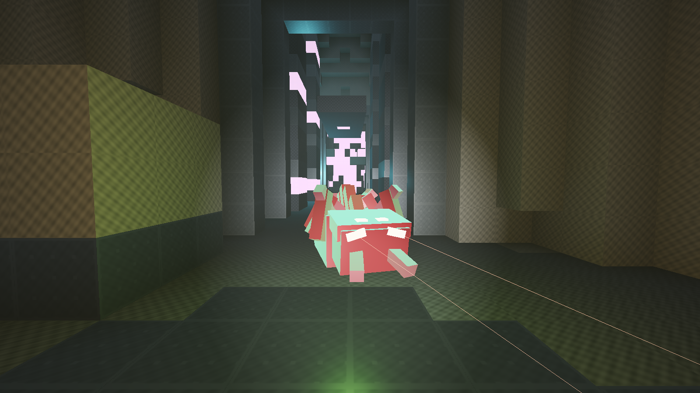
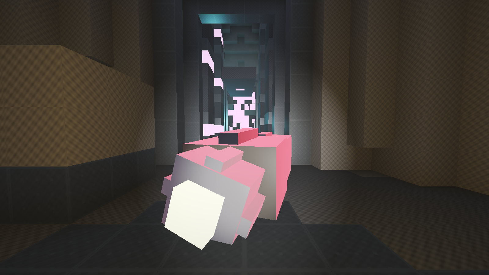

# Enemy Threats & Behaviors

This document lists the hostile life forms native to the void sectors.

---

## 1. Void Stalker

- **Threat Level**: Medium-High (High in unlit areas).
- **Spawn Conditions**: Ambient caves, dark corners, low illumination, triggered by mining drill acoustic vibrations.
- **Model Anatomy & PBR Shading**:
  - Deep void obsidian carapace (`RGB(0.04, 0.04, 0.05)`, Roughness 0.25, Metallic 0.40).
  - Bioluminescent compound ruby eyes casting dynamic tracer lasers (`RGB(0.92, 0.12, 0.96)`, Emissive 6.0).
  - Segmented articulated tail with stinger, mantis scythe claws, and projectile spine quills.
- **Behavior & Cavern Acoustics**:
  - Clings to walls/ceilings using 3D voxel raycasts.
  - Stalks behind the player, leaping to attack when the player begins mining.
  - **Retaliation Pursuit**: When attacked/damaged by the player (e.g. mining drill tip grinding, plasma blaster bolts, or explosive blast damage), the Stalker immediately enrages and relentlessly pursues the player with expanded perception tracking.
  - **Pursuit Break Condition**: The Stalker only loses interest and resumes ambient idling/patrol if the player runs far away (> 32m or breaking line-of-sight across distance) and maintains separation continuously for at least 12 seconds (`pursuit_break_time = 12.0s`).
  - Emits random predatory chitinous shrieks (`SoundCue::StalkerEchoScreech`) every 11–24s that reverberate down cavern corridors up to 58m.
  - High inverse-distance spatial rolloff: at close proximity (< 12m), shrieks are >10x louder with stereo binaural azimuth positioning, triggering a HUD proximity warning.
  - Weak to Scout Sonar pulses (3.0s stun) and bright light sources.

---

## 2. Seismic Burrower

- **Threat Level**: Critical.
- **Spawn Conditions**: Post-Minute 8 (Hazard Phase 3), extraction defense wave escalations.
- **Model Anatomy & PBR Shading**:
  - Rotating conical borer head with 4 radial hardened tungsten cutter teeth (`RGB(0.65, 0.60, 0.55)`, Metallic 0.85).
  - Molten magma apex tip and lateral slag exhaust heat vents (`RGB(2.5, 0.45, 0.05)`, Emissive 6.0).
  - 4-segment articulated serpentine body with sinusoidal crawling articulation and dorsal armor crests.
- **Behavior & Cavern Acoustics**:
  - Destroys soft voxels in its direct path to reach the player.
  - **Retaliation Pursuit**: If damaged while dormant or roaming, the Burrower immediately awakens with a roar and enters persistent pursuit mode, directly locking its borer path onto the player and ignoring ambient sound distractions.
  - **Pursuit Break Condition**: The Burrower will only lose interest and cease its pursuit if the player flees far away (> 35m) and maintains that distant separation for an extended duration of at least 15 seconds (`pursuit_break_time = 15.0s`).
  - Emits low-frequency subterranean tectonic roars (`SoundCue::BurrowerRoar`, 36–62 Hz) every 13–27s, cutter tooth grinding (`SoundCue::BurrowerGrind`), and a deafening breach roar upon erupting into open chambers.
  - Proximity alert: roars within 16m trigger HUD alerts and strong sub-bass stereo rumble.
  - Triggers local cave-ins ([src/voxel/structural_check.cpp](file:///d:/Projects/voxel_3d_voidfall_dredge/src/voxel/structural_check.cpp)).
  - Weak to Demolitionist explosive charges (takes 2.5x damage).

---

## 3. Volatile Crystalline Leech
- **Threat Level**: Low-Medium (Hazardous in groups).
- **Spawn Conditions**: Triggered by breaking Volatile Crystal nodes.
- **Behavior**:
  - Swarms toward mined mineral debris.
  - Explodes on death or contact, chaining detonations with nearby volatile voxels.
