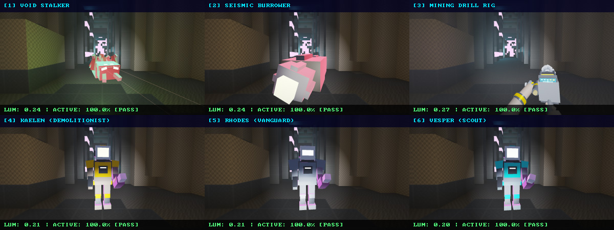
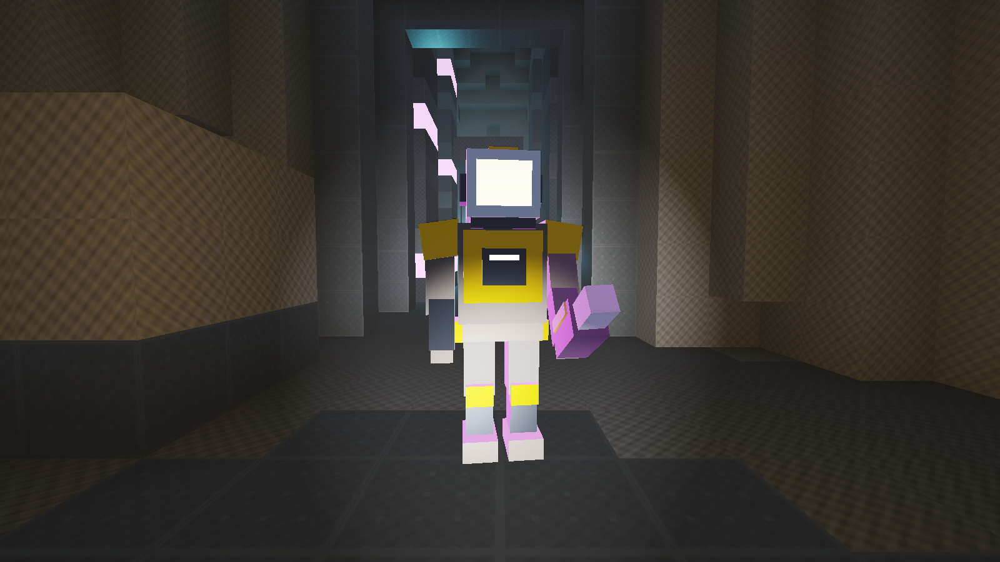
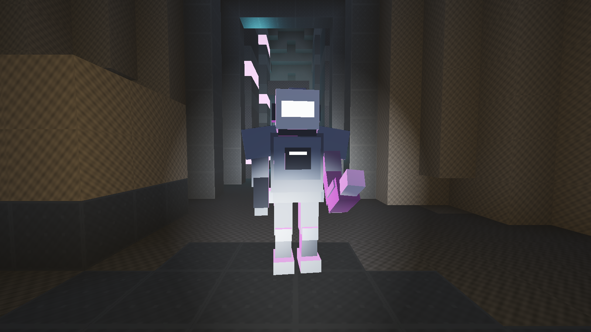
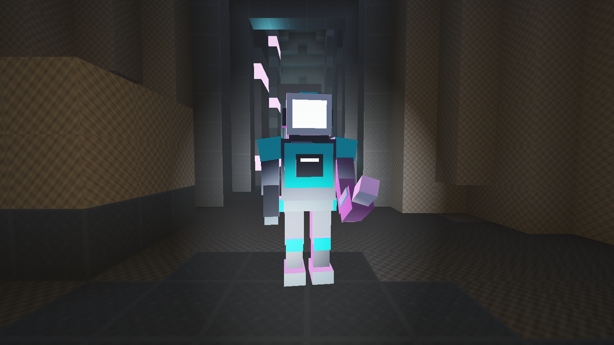

# Delver Contractors & Archetype Specifications

This document catalogs the 3 specialized subterranean contractor archetypes in **Voidfall Dredge**, including their 3D suit models, baseline performance attributes, unique traits, and equipment loadouts.

---

## Master Roster Visual Matrix



---

## 1. Demolitionist — Kaelen



- **Role**: Heavy Breacher // Volatile Mineral Specialist
- **Visual Model & Aesthetics**:
  - Charcoal ballistic pressure weave (`RGB(0.18, 0.20, 0.24)`).
  - Industrial hazard amber primary accents (`RGB(0.95, 0.55, 0.05)`).
  - Amber glowing blast visor (`RGB(1.0, 0.65, 0.10)`, Emissive 5.0).
  - Angled blast deflector pauldrons.
- **Specifications**:
  - **Base Health**: 100 HP
  - **Excavation Speed**: 1.40x (Drill cuts soft and medium rock significantly faster)
  - **Movement Speed**: 1.00x
  - **Primary Combat Firearm**: **Magma Scattergun** (`[2]` or `[X]`)
    - *Capacity*: 6-round revolving drum (manual reload)
    - *Fire Mode*: 5-flechette thermite buckshot cone (37.5 max burst dmg, 38 m/s, amber tracer)
    - *Tactical Role*: Close-quarters predator breaker with heavy concussive knockback.
  - **Tactical Ability**: Concussion Blast (18.0s recharge; triggers directional tunnel blast and stuns enemies)
  - **Passive Trait**: *Surgical Blast & Volatile Refining* (+25% extra yield from Volatile Quartz clusters; directional demolition charges avoid collateral damage to fragile minerals).

---

## 2. Vanguard — Rhodes



- **Role**: Armored Stabilizer // Cave-in Defense Fortress
- **Visual Model & Aesthetics**:
  - Dark alloy armored suit plates with cyan tectonic accents (`RGB(0.20, 0.85, 1.00)`).
  - Heavy ballistic reinforced faceplate with narrow slit optics visor (`RGB(0.20, 0.90, 1.00)`, Emissive 5.0).
  - Double-layered fortress shoulder pauldrons and magnetic anchor boots.
- **Specifications**:
  - **Base Health**: 135 HP
  - **Excavation Speed**: 1.00x
  - **Movement Speed**: 0.88x (Heavy armor trade-off)
  - **Max Placed Bulkheads**: 12 (Industry standard support brackets)
  - **Primary Combat Firearm**: **Plasma Carbine** (`[2]` or `[X]`)
    - *Capacity*: 16-round capacitor battery (passive trickle recharge + manual reload)
    - *Fire Mode*: Rapid-pulse coherent plasma bolt (22 dmg, 52 m/s, electric-cyan tracer)
    - *Tactical Role*: Sustained mid-range suppression against charging Stalkers and Burrowers.
  - **Tactical Ability**: Kinetic Repulsor Field (25.0s recharge; repels loose debris and pushes enemies back)
  - **Passive Trait**: *Tectonic Bulkhead Plating* (50% passive damage reduction from falling roof collapse debris; placed industrial bulkheads deflect ceiling cave-in boulders).

---

## 3. Scout — Vesper



- **Role**: Acoustic Pathfinder // High-Mobility Reconnaissance
- **Visual Model & Aesthetics**:
  - Lightweight aerodynamic composite weave with emerald survey accents (`RGB(0.15, 1.00, 0.45)`).
  - Curved panoramic reconnaissance visor with high-luminance survey optics (`RGB(0.15, 1.00, 0.45)`, Emissive 5.0).
  - Twin vector thruster nozzles mounted on Exo-Pack; wrist-mounted sonar emitter and grapple winch spool.
- **Specifications**:
  - **Base Health**: 80 HP (High-mobility lightweight rig trade-off)
  - **Excavation Speed**: 1.00x
  - **Movement Speed**: 1.20x (+20% sprint/walk velocity)
  - **Grapple Pull Speed**: 1.50x
  - **Sonar Scan Sphere**: 22-meter radius (vs. 14m default)
  - **Primary Combat Firearm**: **Needler Railgun** (`[2]` or `[X]`)
    - *Capacity*: 8-round needle cartridge (manual reload)
    - *Fire Mode*: Hyper-velocity electromagnetic needle (42 dmg, 110 m/s, zero spread, emerald tracer)
    - *Tactical Role*: Long-distance cavern sniper; neutralizes ceiling ambush predators before they descend.
  - **Tactical Ability**: Seismic Sonar Overdrive (12.0s recharge; emits 360-degree sonic shockwave that stuns Stalkers for 3.0s and reveals all mineral veins through solid rock)
  - **Passive Trait**: *Acoustic Resonance & High-Tension Winch* (Extended scan outline linger, rapid grapple ascension to escape ambushes).

---

## Model Reference Generation

All character and enemy reference captures are maintained in [`docs/models/`](file:///d:/Projects/voxel_3d_voidfall_dredge/docs/models/) and regenerated automatically via:

```bash
python scripts/capture_models.py
```
