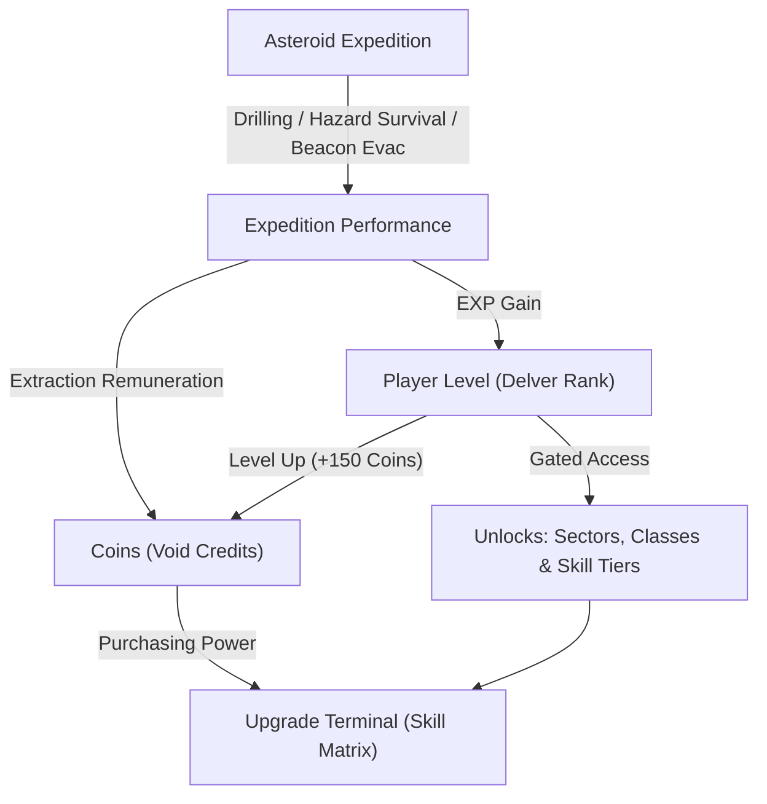

# Progression & Economy Architecture

Voidfall Dredge implements a dual-stream progression loop decoupling **Player Level (Delver Rank)** from **Upgrade Purchasing Power (Coins)**.

---

## 1. Core Vision & Progression Loop

Prior versions directly consumed raw EXP to buy skill nodes. The revamped system establishes clear separation of concerns:
- **EXP (Delver Experience)**: Earned through drilling, extracting minerals, surviving hazard intervals, and completing expeditions. EXP is permanently banked to increase **Player Level**. EXP is never spent or lost.
- **Player Level (Delver Rank)**: Gatekeeper for game content. Raising rank unlocks higher skill tiers, deeper asteroid sectors, and advanced delver class archetypes.
- **Coins (Void Credits)**: Standard expedition remuneration currency. Awarded at the end of runs and upon level-up. Spent at the Upgrade Terminal to unlock and advance skill tree nodes.
- **Specialty Minerals (Voidite & Titanium)**: High-tier crafting reagents required alongside Coins for Tier 2+ and Tier 3+ upgrades.

---

## 2. EXP & Delver Rank Thresholds

EXP accumulates cumulatively. Reaching a threshold increments the Delver Rank and instantly triggers a **+150 Coin Level-Up Bonus**.

| Delver Rank | Cumulative EXP Required | Delta EXP to Next | Key Unlocks |
|:---:|:---:|:---:|:---|
| **Level 1** | 0 | 300 | Sector 1 (Shallow Vein), Demolitionist Archetype, Tier 1 Skills |
| **Level 2** | 300 | 400 | Sector 2 (Sunken Core), Vanguard Archetype, Tier 2 Skills |
| **Level 3** | 700 | 600 | Scout Archetype, Tier 3 Skills |
| **Level 4** | 1,300 | 900 | Sector 3 (Abyssal Chasm), Tier 4 Skills |
| **Level 5** | 2,200 | 1,500 | Master Mastery, Tier 5 Skills (Capstone) |
| **Level $N \ge 6$** | $2200 + (N - 5) \times 1500$ | 1,500 | Paragon Bonus Remuneration (+150 Coins per rank) |

---

## 3. Coin Remuneration & Economy

Coins are calculated at run completion in `PlayerInventory::finalize_run`:

$$\text{Run Coins} = \text{Base Remuneration} + (\text{Completion \%} \times 1.0) + (V \times 3) + (T \times 5) + (R \times 100)$$

Where:
- $\text{Base Remuneration} = 150$ on successful extraction ($0$ on squad wipe).
- $V = \text{Voidite extracted}$.
- $T = \text{Titanium extracted}$.
- $R = \text{Relics / Anomalies extracted}$.
- **Abandonment / Emergency Pod**: If an expedition is abandoned before the primary extraction beacon holdout succeeds, total payout is discounted by 50%.

---

## 4. Upgrade Tree Costs & Level Gating

Each skill branch (Mining, Movement, Survival, Sonar) contains 5 sequential tiers. Purchasing a node requires meeting both the **Player Level Requirement** and paying the **Coin / Mineral Cost**.

| Tier | Required Player Level | Coin Cost | Voidite Cost | Titanium Cost |
|:---:|:---:|:---:|:---:|:---:|
| **Tier 1** | Level 1 | 100 | 0 | 0 |
| **Tier 2** | Level 2 | 160 | 5 | 0 |
| **Tier 3** | Level 3 | 256 | 10 | 3 |
| **Tier 4** | Level 4 | 410 | 15 | 6 |
| **Tier 5** | Level 5 | 656 | 20 | 10 |

### Exponential Scaling Formula
$$\text{Cost}(\text{tier}) = \left\lfloor 100 \times 1.6^{\text{tier}-1} \right\rfloor$$

### Respec Economics
Players can reset all skill trees at the Orbital Hub Terminal at any time. Respec yields an **85% Coin refund** of all spent credits. The 15% delta represents the contractor re-calibration fee. The player's **EXP and Delver Rank are never reduced or reset during respec**.

---

## 5. Sector & Archetype Level Gating

Content access in the Orbital Hub dynamically enforces Player Level constraints:

### Sectors
- **Sector 1 (The Shallow Vein)**: Unlocked at **Level 1** (default). Open rooms, basic basalt, low radiation escalation.
- **Sector 2 (The Sunken Core)**: Unlocked at **Level 2**. Reinforced vault doors, caustic gas pockets, seismic tremor intervals.
- **Sector 3 (The Abyssal Chasm)**: Unlocked at **Level 4**. Radioactive sanctuary cores, vertical abyss drops, lethal Void Stalker ambushes.

### Delver Archetypes
- **Demolitionist**: Unlocked at **Level 1** (Heavy drill, seismic explosive charges).
- **Vanguard**: Unlocked at **Level 2** (Reinforced bulkhead shield, heavy kinetic ram).
- **Scout**: Unlocked at **Level 3** (High-mobility grapple thrusters, broad-spectrum sonar surveyor).
