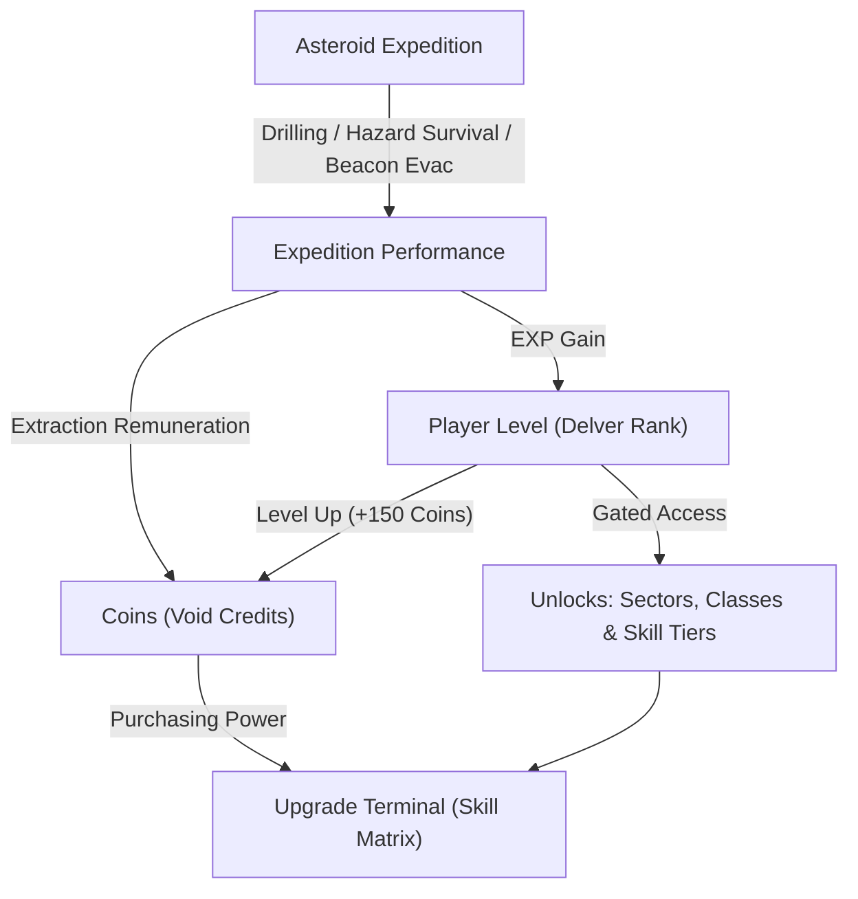

# Progression & Economy Architecture

Voidfall Dredge implements a dual-stream progression loop decoupling **Player Level (Delver Rank)** from **Upgrade Purchasing Power (Coins)**.

---

## 1. Core Vision & Progression Loop

Prior versions directly consumed raw EXP to buy skill nodes. The revamped system establishes clear separation of concerns:
- **EXP (Delver Experience)**: Earned through drilling, extracting minerals, surviving hazard intervals, and completing expeditions. EXP is permanently banked to increase **Player Level**. EXP is never spent or lost.
- **Player Level (Delver Rank)**: Gatekeeper for game content. Raising rank unlocks higher skill tiers, deeper asteroid sectors, and advanced delver class archetypes.
- **Coins (Void Credits)**: Standard expedition remuneration currency. Awarded at the end of runs and upon level-up. Spent at the Upgrade Terminal to unlock and advance skill tree nodes.
- **Specialty Minerals (Voidite & Titanium)**: High-tier crafting reagents required alongside Coins for Tier 2+ and Tier 3+ upgrades.

```mermaid
graph TD
    Expedition["Asteroid Expedition"] -->|"Drilling / Hazard Survival / Beacon Evac"| Rewards["Expedition Performance"]
    Rewards -->|"EXP Gain"| DelverRank["Player Level (Delver Rank)"]
    Rewards -->|"Extraction Remuneration"| Coins["Coins (Void Credits)"]
    DelverRank -->|"Level Up (+150 Coins)"| Coins
    DelverRank -->|"Gated Access"| Unlocks["Unlocks: Sectors, Classes & Skill Tiers"]
    Coins -->|"Purchasing Power"| UpgradeTerminal["Upgrade Terminal (Skill Matrix)"]
    Unlocks --> UpgradeTerminal
```

---

## 2. EXP & Delver Rank Thresholds

EXP accumulates cumulatively. Reaching a threshold increments the Delver Rank and instantly triggers a **+150 Coin Level-Up Bonus**.

| Delver Rank | Cumulative EXP Required | Delta EXP to Next | Key Unlocks |
|:---:|:---:|:---:|:---|
| **Level 1** | 0 | 300 | Sector 1 (Shallow Vein), Demolitionist Archetype, Tier 1 Skills |
| **Level 2** | 300 | 400 | Sector 2 (Sunken Core), Vanguard Archetype, Tier 2 Skills |
| **Level 3** | 700 | 600 | Scout Archetype, Tier 3 Skills |
| **Level 4** | 1,300 | 900 | Sector 3 (Abyssal Chasm), Tier 4 Skills |
| **Level 5** | 2,200 | 1,500 | Master Mastery, Tier 5 Skills (Capstone) |
| **Level $N \ge 6$** | $2200 + (N - 5) \times 1500$ | 1,500 | Paragon Bonus Remuneration (+150 Coins per rank) |

---

## 3. Coin Remuneration & Economy

Coins are calculated at run completion in `PlayerInventory::finalize_run`:

$$\text{Run Coins} = \text{Base Remuneration} + (\text{Completion \%} \times 1.0) + (V \times 3) + (T \times 5) + (R \times 100)$$

Where:
- $\text{Base Remuneration} = 150$ on successful extraction ($0$ on squad wipe).
- $V = \text{Voidite extracted}$.
- $T = \text{Titanium extracted}$.
- $R = \text{Relics / Anomalies extracted}$.
- **Abandonment / Emergency Pod**: If an expedition is abandoned before the primary extraction beacon holdout succeeds, total payout is discounted by 50%.

---

---

## 4. Progressive Skill Tree Matrix (6 Disciplines, 18 Specializations)

The skill system features a 6-discipline web structure radiating from the central core matrix, mirroring orbital engineering proficiencies. The tree contains **18 specialized nodes** organized into 6 disciplines with a total of **60 points** across the full matrix ($6 \times [5 + 3 + 2] = 60$).

### 4.1 Disciplines & Node Hierarchy

Each discipline follows a progressive prerequisite structure: **Foundation (Max 5)** $\rightarrow$ **Specialization (Max 3)** $\rightarrow$ **Capstone (Max 2)**. Specializations require at least Tier 1 in the Foundation node, and Capstones require at least Tier 1 in the Specialization node.

| Discipline | Foundation (Max 5) | Specialization (Max 3) | Capstone (Max 2) |
|---|---|---|---|
| **Excavation** | `Drill Speed` (+12%/tier mining speed) | `Drill Durability` (-15% heat, +20% cooling) | `Micro-Charges` (+20%/tier high-grade mineral yield) |
| **Traversal** | `Thruster Tank` (+20%/tier fuel capacity) | `Kinetic Dynamo` (+15%/tier sprint/fall recharge) | `Sonar Frequency` (+2m radius, -1s CD, T2 HUD labels) |
| **Defense** | `Reinforced Plating` (+15 HP, -10% debris damage) | `Kinetic Shielding` (+12 Shield, -0.5s recharge delay) | `Defibrillator` (Second Wind survive lethal trauma) |
| **Stealth** | `Acoustic Dampening` (-20%/tier noise radius) | `Shadow Veil` (-15%/tier optical sightline range) | `Ambush Protocol` (+35%/tier unalerted strike damage) |
| **Melee** | `Pneumatic Impact` (+30%/tier shove damage & stagger)| `Cleave Shockwave` (90° cleave arc & shock stun) | `Berserker Overdrive` (+12 Shield siphon & speed burst) |
| **Gun Damage** | `Hyper-Velocity Slugs` (+12%/tier weapon projectile dmg)| `Rapid Cycling` (+8% fire rate, +10% reload speed) | `Critical Weakpoint` (+35%/tier weakpoint headshot dmg) |

### 4.2 Campaign Point Cap vs. Post-Game Grandmaster Matrix

To preserve tactical tension, build diversity, and specialization:
- **Campaign Point Cap (24 Points Max)**: Prior to completing the entire game (clearing Sector 3: The Void Cradle), players can allocate a maximum of **24 points** (out of 60). Even if a player accumulates surplus EXP, additional nodes are locked with `CampaignCapReached` (`NodeWebState::CampaignCapped`).
- **Respec Necessity**: Because the campaign cap is 24 points, players cannot acquire all skills simultaneously during the main game. To experience different paths (e.g., switching from a Gun Damage / Melee combat build to a pure Stealth / Defense infiltrator), players must **respec**.
- **100% Full EXP Refund**: Respec at the Upgrade Terminal refunds **100% of all spent EXP**, instantly returning the full EXP pool to the player and resetting assigned points to 0 so they can immediately redistribute into alternative disciplines.
- **Post-Game Grandmaster Matrix (60 Points)**: Upon clearing Sector 3 (completing the main story expedition), the point limit expands to **60 points**, allowing dedicated delvers to achieve 100% mastery across all 6 disciplines.

### 4.3 Exponential EXP Cost Scaling Formula
$$\text{Cost}(\text{tier}) = \left\lfloor 100 \times 1.6^{\text{tier}-1} \right\rfloor$$
- **Tier 1**: 100 EXP
- **Tier 2**: 160 EXP
- **Tier 3**: 256 EXP
- **Tier 4**: 410 EXP
- **Tier 5**: 656 EXP

Upgrades strictly consume Delver EXP. Mining minerals (Voidite & Titanium) and Credits remain untouched.

---

## 5. Sector & Archetype Level Gating

Content access in the Orbital Hub dynamically enforces Player Level constraints:

### Sectors
- **Sector 1 (The Shallow Vein)**: Unlocked at **Level 1** (default). Open rooms, basic basalt, low radiation escalation.
- **Sector 2 (The Sunken Core)**: Unlocked at **Level 2**. Reinforced vault doors, caustic gas pockets, seismic tremor intervals.
- **Sector 3 (The Abyssal Chasm)**: Unlocked at **Level 4**. Radioactive sanctuary cores, vertical abyss drops, lethal Void Stalker ambushes.

### Delver Archetypes
- **Demolitionist**: Unlocked at **Level 1** (Heavy drill, seismic explosive charges).
- **Vanguard**: Unlocked at **Level 2** (Reinforced bulkhead shield, heavy kinetic ram).
- **Scout**: Unlocked at **Level 3** (High-mobility grapple thrusters, broad-spectrum sonar surveyor).
